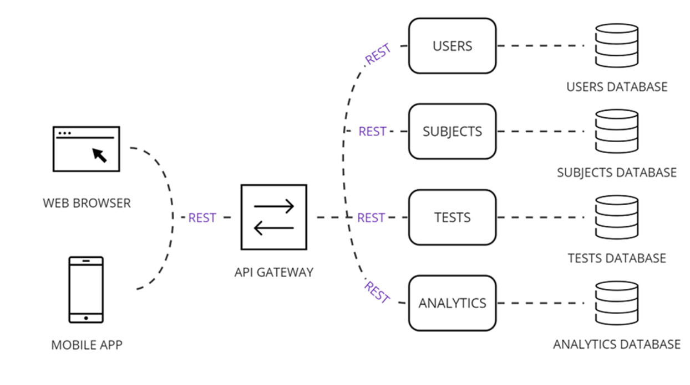

# Quiz-platform for education | Платформа викторин для образования

This repository contains a tool for interactively performing smart cross-testing. Online version available at

## Demo
*in the process of implementation

## Documentation
*in the process of implementation

## Architecture

## Methods
To check their mastery of the material after the lecture, students make their own tests. Tests of other students are then completed before the next lesson. As a result, 2 numerical characteristics are obtained.

1 numerical characteristic – analyticity.
Analyticity – the ability to analyze data and information. This characteristic is calculated using the student's test scores and the average formula, but outliers are excluded if there are any.
Robust average formula:

  

Based on this formula, the average will be the median value of the grades for all classes. Using this formula minimizes the impact of outliers on a student's results.

2nd numerical characteristic – creativity.
Creativity is the ability to find non-standard solutions and come up with interesting and moderately complex questions. The student must design the test so that it will challenge other students to varying degrees of difficulty. This characteristic is calculated using the robust coefficient of variation formula.
Formula for robust coefficient of variation:

  

## Installation

## Sources

- [УПРАВЛЕНИЕ ОБРАЗОВАТЕЛЬНЫМ ПРОЦЕССОМ]([https://www.sciencedirect.com/science/article/pii/S1877050923020094](https://science-education.ru/ru/article/view?id=13932))
- [Образование в цифровую эпоху]([https://arxiv.org/abs/2312.04330](https://magellan.pro/2019/03/04/obrazovanie-v-cifrovuju-jepohu/)https://magellan.pro/2019/03/04/obrazovanie-v-cifrovuju-jepohu/)
